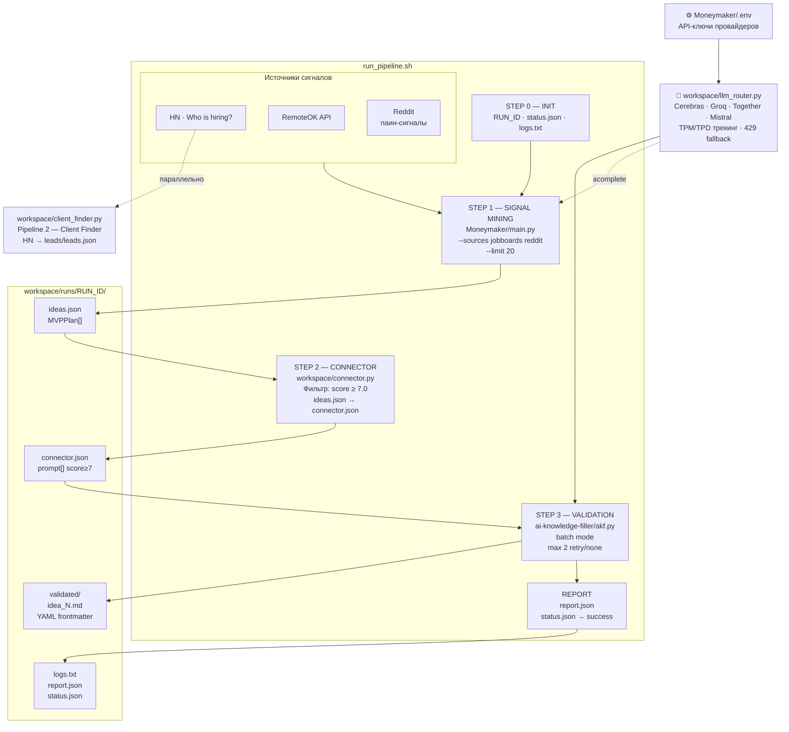

# AI Factory

Автономный конвейер генерации и валидации product-идей.
Запускается одной командой, работает без UI.

---

## Быстрый старт

```bash
# Живой прогон (нужен CEREBRAS_API_KEY / GROQ_API_KEY в Moneymaker/.env)
bash run_pipeline.sh

# Без внешних вызовов (mock-данные, проверка pipeline)
bash run_pipeline.sh --dry-run
```

Результаты — в `workspace/runs/<RUN_ID>/`.

---

## Архитектура



---

## Pipeline пошагово

### STEP 0 — INIT

```
RUN_ID = run_YYYYMMDD_HHMMSS
workspace/runs/$RUN_ID/
  status.json   ← {"step":"init","status":"pending"}
  logs.txt      ← append-only лог каждого шага
```

Загружает `Moneymaker/.env`. Проверяет наличие хотя бы одного LLM-ключа.
При `--dry-run` проверка ключей пропускается.

---

### STEP 1 — Signal Mining (`Moneymaker`)

```bash
python Moneymaker/main.py \
  --sources jobboards reddit \
  --limit 20 \
  --output $BASE/ideas.json \
  --no-fulfill --no-distribute
```

| Источник | Что собирает |
|---|---|
| `jobboards` | HN «Ask HN: Who is hiring?» + RemoteOK API |
| `reddit` | Pain-сигналы из профильных сабреддитов |

Выход: `ideas.json` — массив `MVPPlan` с полями `idea`, `score`, `revenue_model`, `format`.

При ошибке — одна автоматическая retry. Если и она упала — `STOP`.
Пустой `ideas.json` → `STOP`.

---

### STEP 2 — Connector

```bash
python workspace/connector.py \
  --input  $BASE/ideas.json \
  --output $BASE/connector.json
```

- Фильтрует идеи с `score < 7.0`
- Преобразует каждую `MVPPlan` в AKF-промпт: `"Create a solution spec: <title>. Target user: … Solution: … Revenue model: …"`
- Если ни одна идея не прошла фильтр — `STOP` с exit code 2

Выход: `connector.json` — массив `{prompt, score, source}`.

---

### STEP 3 — Validation (`AKF`)

```bash
python ai-knowledge-filler/akf.py batch \
  --input  $BASE/connector.json \
  --output $BASE/validated/
```

Для каждой идеи:

1. Вызывает `router.complete("validation", prompt, system_prompt=_SYSTEM_PROMPT)`
2. Валидирует YAML-frontmatter по схеме (E001–E008)
3. При ошибке — добавляет инструкцию к промпту, retry (max 2)
4. Третий провал → идея пропускается, pipeline продолжается
5. Если **ни одна** идея не прошла → `STOP`

Схема выходного файла `validated/idea_N.md`:

```yaml
---
title: "..."
type: guide | reference | checklist
domain: automation | maritime | api-design | devops
level: beginner | intermediate | advanced
status: active
tags: [tag1, tag2, tag3]
created: "2026-04-04T12:00:00Z"
updated: "2026-04-04T12:00:00Z"
---
## Problem
## Target User
## Solution
## Revenue Model
## MVP Format
## Estimated Build Time
## Validation Steps
## Tech Stack
```

---

### REPORT

```json
{
  "run_id": "run_20260404_142501",
  "mode": "GENERATE_ONLY",
  "status": "success",
  "dry_run": false,
  "steps_completed": ["init", "idea_gen", "connector", "validation"],
  "ideas_validated": 4,
  "errors": []
}
```

---

## LLM Router

`workspace/llm_router.py` — единая точка всех LLM-вызовов.

```
router.complete("validation", prompt)   ← sync, без asyncio (akf.py)
await router.acomplete("generation", prompt)  ← async (idea_generator.py)
```

| Провайдер | Ключ | Модель | TPM / TPD |
|---|---|---|---|
| Cerebras | `CEREBRAS_API_KEY` | llama3.1-8b | 60k / 1M |
| Groq | `GROQ_API_KEY` | llama-3.3-70b-versatile | 6k / 500k |
| Together AI | `TOGETHER_API_KEY` | Llama-3.3-70B-Turbo | — / — |
| Mistral | `MISTRAL_API_KEY` | mistral-small-latest | — / — |

Логика выбора: preferred → TPM/TPD check → 429 cooldown → следующий провайдер.
Cerebras использует официальный SDK (не httpx).

---

## Pipeline 2 — Client Finder (отдельный скрипт)

```bash
python workspace/client_finder.py --limit 50
python workspace/client_finder.py --dry-run   # без сети
```

Сканирует HN «Who is hiring?» на ключевые слова cloud / AWS / devops / cost / monitoring.
Выход: `workspace/leads/leads.json`

```json
[
  {
    "company": "Acme Cloud",
    "contact": "founder@acme.io",
    "pain": "AWS costs spiraling, need optimization",
    "hn_url": "https://news.ycombinator.com/item?id=...",
    "score": 9
  }
]
```

---

## Структура проекта

```
ai-factory/
├── run_pipeline.sh              ← точка входа
├── Moneymaker/                  ← STEP 1: signal mining + idea generation
│   ├── main.py
│   ├── src/
│   │   ├── engine.py
│   │   ├── idea_generator.py    ← router.acomplete("generation")
│   │   ├── money_filter.py
│   │   ├── signal_miner/
│   │   │   ├── jobboards.py     ← HN + RemoteOK
│   │   │   └── reddit.py
│   │   └── ...
│   └── .env                     ← API ключи (не коммитить)
├── workspace/
│   ├── llm_router.py            ← централизованный LLM router
│   ├── connector.py             ← STEP 2: фильтрация + маппинг
│   ├── client_finder.py         ← Pipeline 2: поиск клиентов
│   ├── leads/
│   │   └── leads.json
│   └── runs/
│       └── run_YYYYMMDD_HHMMSS/
│           ├── ideas.json
│           ├── connector.json
│           ├── validated/
│           │   └── idea_N.md
│           ├── logs.txt
│           ├── status.json
│           └── report.json
├── ai-knowledge-filler/
│   ├── akf.py                   ← STEP 3: генерация + валидация схемы
│   └── ...
└── Agent-Guidelines-for-Upwork-Learning-Projects/
    └── ...                      ← STEP 4/5: Sheets + email (FULL_PIPELINE)
```

---

## Режимы запуска

| Режим | Команда | Внешние вызовы |
|---|---|---|
| `DRY_RUN` | `bash run_pipeline.sh --dry-run` | нет (mock-данные) |
| `GENERATE_ONLY` | `bash run_pipeline.sh` | LLM API только |
| `FULL_PIPELINE` | см. CLAUDE.md | LLM + Sheets + email |

---

## Настройка

```bash
# Минимальная конфигурация (достаточно одного ключа)
echo "CEREBRAS_API_KEY=your_key" >> Moneymaker/.env

# Опционально
echo "GROQ_API_KEY=your_key"      >> Moneymaker/.env
echo "TOGETHER_API_KEY=your_key"  >> Moneymaker/.env
echo "MISTRAL_API_KEY=your_key"   >> Moneymaker/.env

# Зависимости
pip install httpx cerebras-cloud-sdk groq anthropic pydantic-settings rich python-dotenv
```

---

## Коды ошибок AKF

| Код | Поле | Исправление |
|---|---|---|
| E001 | title | отсутствует |
| E002 | type | не из `guide\|reference\|checklist` |
| E003 | domain | не из `automation\|maritime\|api-design\|devops` |
| E004 | level | не из `beginner\|intermediate\|advanced` |
| E005 | status | не `active` |
| E006 | tags | меньше 3 тегов |
| E007 | created/updated | не ISO 8601 |
| E008 | структура | нет YAML-блока `---` |
